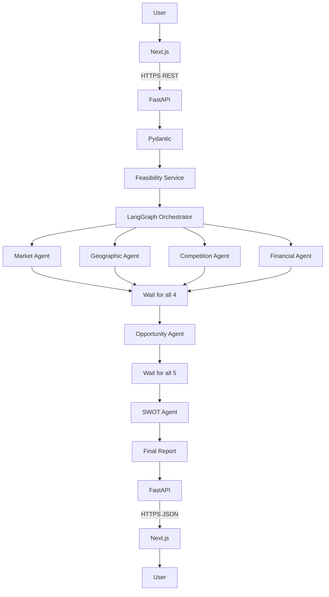
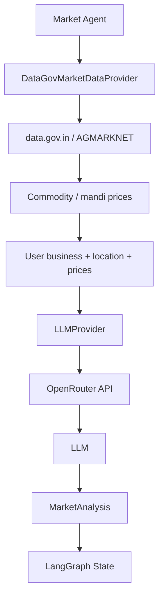
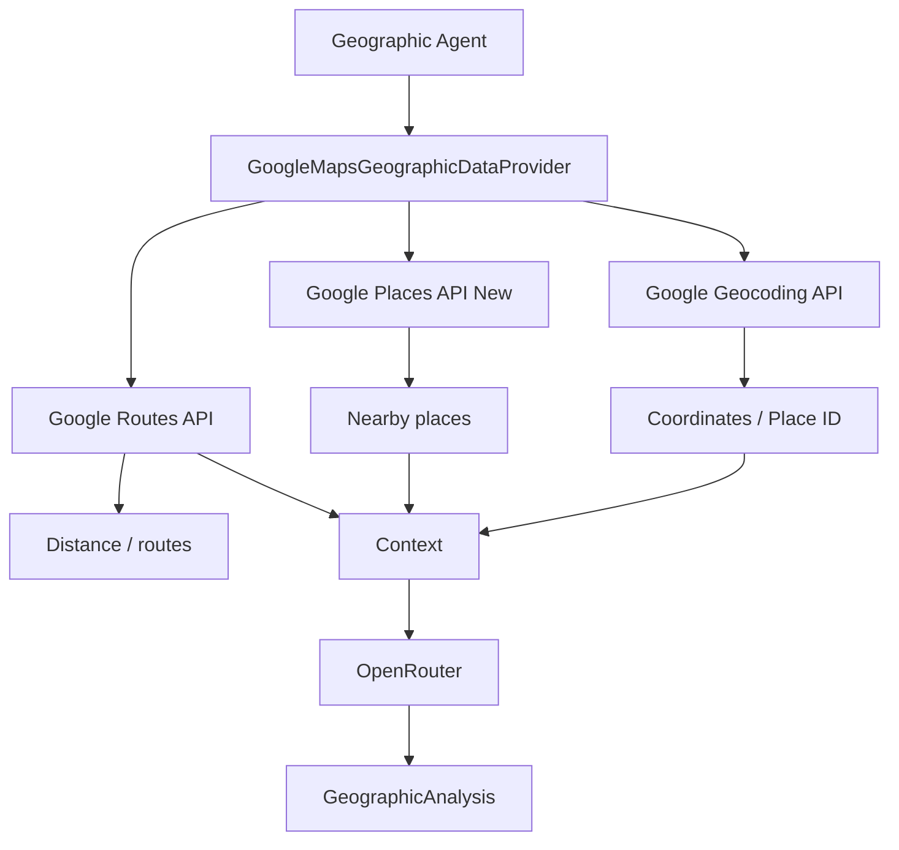
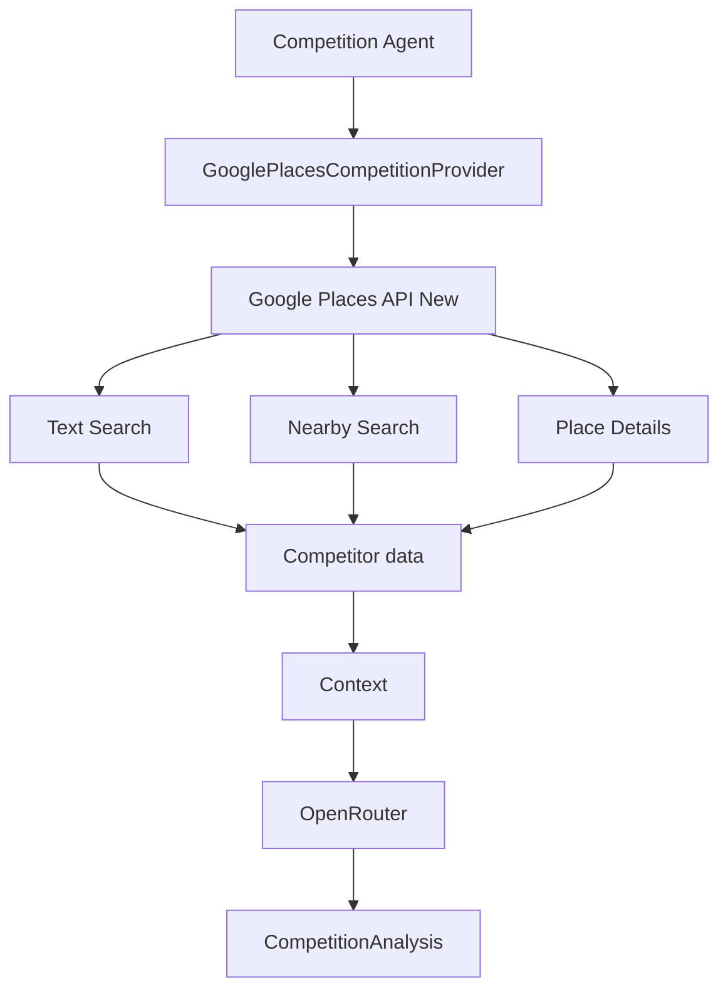
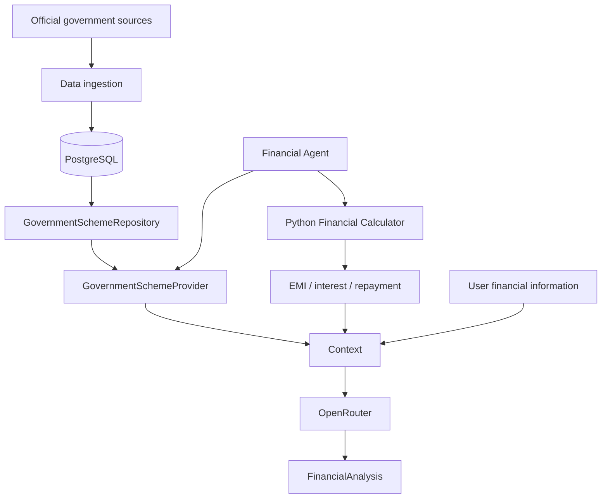
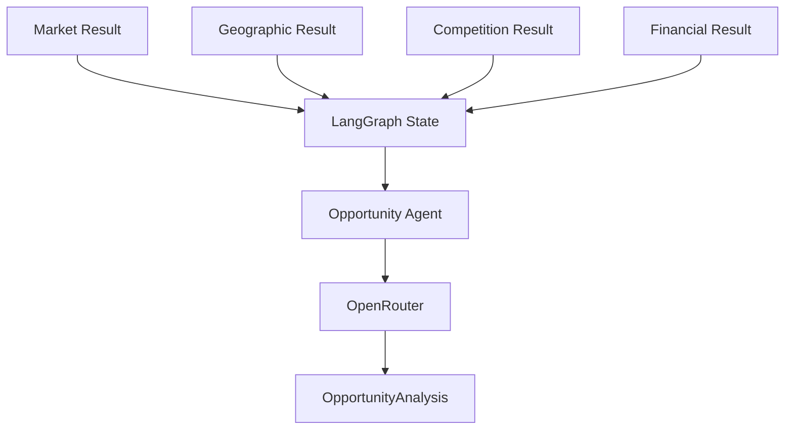
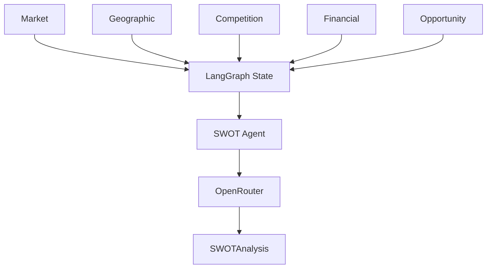
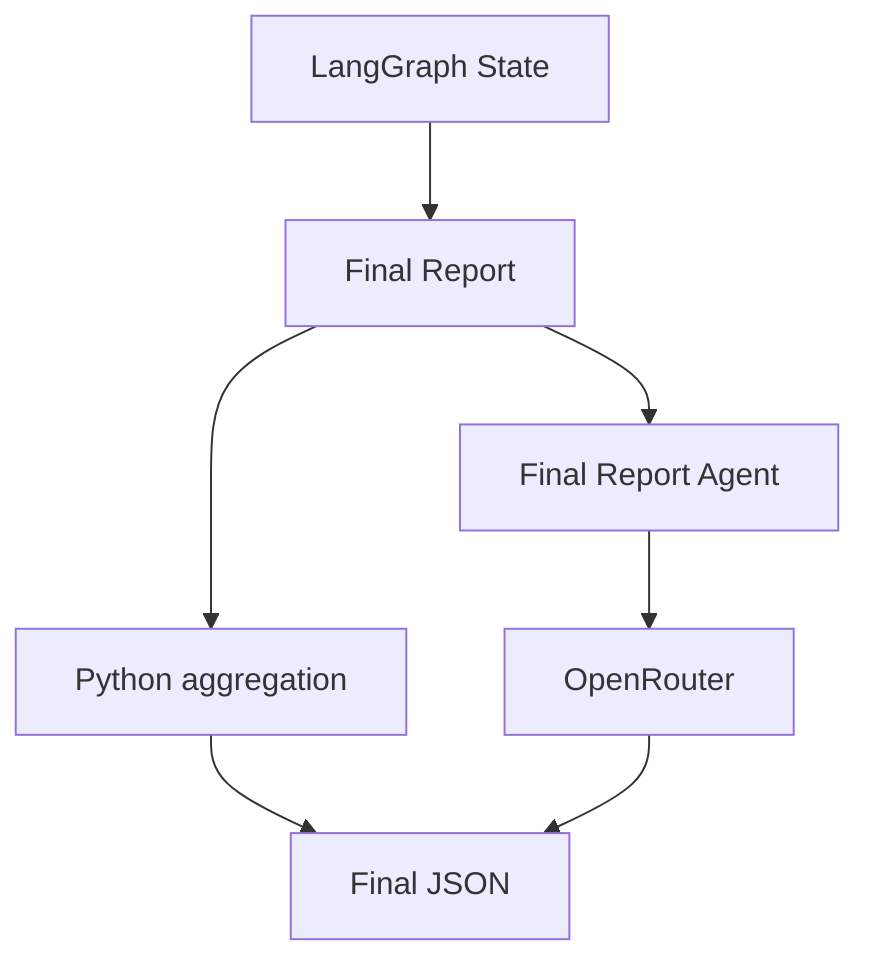
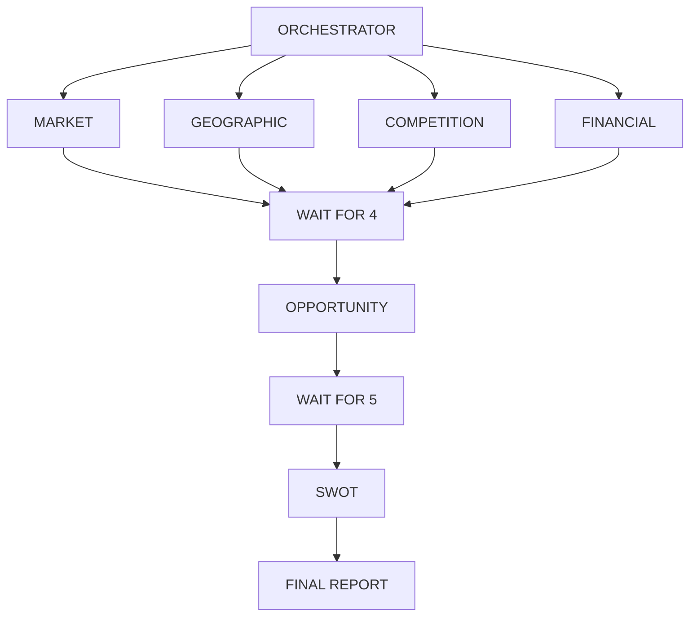

# Architecture diagrams

## 1. System

```mermaid
flowchart TB
  user[User]
  web[Next.js]
  api[FastAPI]
  val[Pydantic]
  svc[Feasibility Service]
  orch[LangGraph Orchestrator]
  user --> web -->|HTTPS REST| api --> val --> svc --> orch
  orch --> m[Market Agent]
  orch --> g[Geographic Agent]
  orch --> c[Competition Agent]
  orch --> f[Financial Agent]
  m --> w4[Wait for all 4]
  g --> w4
  c --> w4
  f --> w4
  w4 --> opp[Opportunity Agent]
  opp --> w5[Wait for all 5]
  w5 --> swot[SWOT Agent]
  swot --> report[Final Report]
  report --> api2[FastAPI]
  api2 -->|HTTPS JSON| web2[Next.js]
  web2 --> user2[User]
```

## 2. Market

```mermaid
flowchart TB
  a[Market Agent] --> p[DataGovMarketDataProvider]
  p --> api[data.gov.in / AGMARKNET]
  api --> data[Commodity / mandi prices]
  data --> ctx[User business + location + prices]
  ctx --> llm[LLMProvider]
  llm --> or[OpenRouter API]
  or --> model[LLM]
  model --> out[MarketAnalysis]
  out --> state[LangGraph State]
```

## 3. Geographic

```mermaid
flowchart TB
  a[Geographic Agent] --> p[GoogleMapsGeographicDataProvider]
  p --> geo[Google Geocoding API]
  p --> places[Google Places API New]
  p --> routes[Google Routes API]
  geo --> facts[Coordinates / Place ID]
  places --> nearby[Nearby places]
  routes --> dist[Distance / routes]
  facts --> ctx[Context]
  nearby --> ctx
  routes --> ctx
  ctx --> or[OpenRouter]
  or --> out[GeographicAnalysis]
```

## 4. Competition

```mermaid
flowchart TB
  a[Competition Agent] --> p[GooglePlacesCompetitionProvider]
  p --> places[Google Places API New]
  places --> ts[Text Search]
  places --> ns[Nearby Search]
  places --> pd[Place Details]
  ts --> data[Competitor data]
  ns --> data
  pd --> data
  data --> ctx[Context]
  ctx --> or[OpenRouter]
  or --> out[CompetitionAnalysis]
```

## 5. Financial

```mermaid
flowchart TB
  a[Financial Agent]
  src[Official government sources]
  src --> ing[Data ingestion]
  ing --> db[(PostgreSQL)]
  db --> repo[GovernmentSchemeRepository]
  repo --> prov[GovernmentSchemeProvider]
  calc[Python Financial Calculator]
  calc --> emi[EMI / interest / repayment]
  prov --> ctx[Context]
  emi --> ctx
  user[User financial information] --> ctx
  ctx --> or[OpenRouter]
  or --> out[FinancialAnalysis]
  a --> prov
  a --> calc
```

## 6. Opportunity

```mermaid
flowchart TB
  m[Market Result] --> s[LangGraph State]
  g[Geographic Result] --> s
  c[Competition Result] --> s
  f[Financial Result] --> s
  s --> a[Opportunity Agent]
  a --> or[OpenRouter]
  or --> out[OpportunityAnalysis]
```

## 7. SWOT

```mermaid
flowchart TB
  m[Market] --> s[LangGraph State]
  g[Geographic] --> s
  c[Competition] --> s
  f[Financial] --> s
  o[Opportunity] --> s
  s --> a[SWOT Agent]
  a --> or[OpenRouter]
  or --> out[SWOTAnalysis]
```

## 8. Final report

```mermaid
flowchart TB
  s[LangGraph State] --> fr[Final Report]
  fr --> a[Python aggregation]
  fr --> b[Final Report Agent]
  b --> or[OpenRouter]
  a --> json[Final JSON]
  or --> json
```

## 9. Parallelism

```mermaid
flowchart TB
  orch[ORCHESTRATOR]
  orch --> m[MARKET]
  orch --> g[GEOGRAPHIC]
  orch --> c[COMPETITION]
  orch --> f[FINANCIAL]
  m --> w4[WAIT FOR 4]
  g --> w4
  c --> w4
  f --> w4
  w4 --> o[OPPORTUNITY]
  o --> w5[WAIT FOR 5]
  w5 --> s[SWOT]
  s --> r[FINAL REPORT]
```
